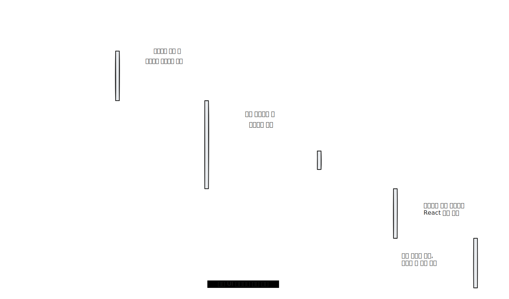
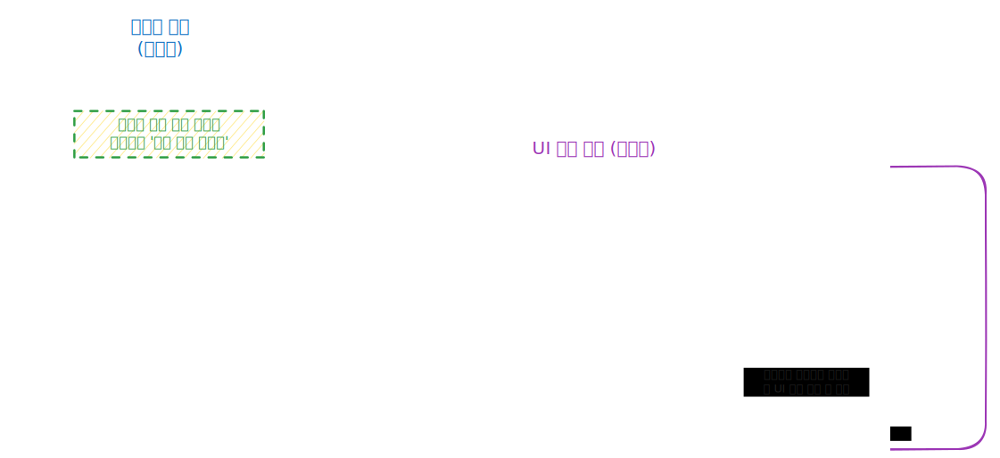

<style>

@font-face {
    font-family: 'D2Coding';
    src: url('https://fastly.jsdelivr.net/gh/projectnoonnu/noonfonts_three@1.0/D2Coding.woff') format('woff');
    font-weight: normal;
    font-style: normal;
}

@font-face {
    font-family: 'SUIT-Regular';
    src: url('https://fastly.jsdelivr.net/gh/projectnoonnu/noonfonts_suit@1.0/SUIT-Regular.woff2') format('woff2');
    font-weight: normal;
    font-style: normal;
}

@font-face {
    font-family: 'NanumSquareNeo';
    src: url(https://hangeul.pstatic.net/hangeul_static/webfont/NanumSquareNeo/NanumSquareNeoTTF-bRg.eot);
    src: url(https://hangeul.pstatic.net/hangeul_static/webfont/NanumSquareNeo/NanumSquareNeoTTF-bRg.eot?#iefix) format("embedded-opentype"), url(https://hangeul.pstatic.net/hangeul_static/webfont/NanumSquareNeo/NanumSquareNeoTTF-bRg.woff) format("woff"), url(https://hangeul.pstatic.net/hangeul_static/webfont/NanumSquareNeo/NanumSquareNeoTTF-bRg.ttf) format("truetype");
}

@font-face {
    font-family: 'NanumSquareNeoExtraBold';
    src: url(https://hangeul.pstatic.net/hangeul_static/webfont/NanumSquareNeo/NanumSquareNeoTTF-dEb.eot);
    src: url(https://hangeul.pstatic.net/hangeul_static/webfont/NanumSquareNeo/NanumSquareNeoTTF-dEb.eot?#iefix) format("embedded-opentype"), url(https://hangeul.pstatic.net/hangeul_static/webfont/NanumSquareNeo/NanumSquareNeoTTF-dEb.woff) format("woff"), url(https://hangeul.pstatic.net/hangeul_static/webfont/NanumSquareNeo/NanumSquareNeoTTF-dEb.ttf) format("truetype");
}

h1, h2 {
font-family: NanumSquareNeoExtraBold
}

p:has(img) {
   text-align: center;
}

iframe {  border: 1px solid silver; zoom: 100%; height: 100%; }

section {
  padding-top: 50px;
  user-select: none;
  font-family: NanumSquareNeo, sans-serif;
  font-size: 1.8rem;
  letter-spacing: 0.5px;
  display: flex;
  flex-direction: column;
  justify-content: start;
}

table {
    justify-content: center;
}

table > tbody > tr > td {
  zoom: 80%;
}

blockquote {
  zoom: 95%;
}

</style>

<style scoped> * { text-align: center } section { justify-content: center; } </style>

# **AI 기반 UI 생성 시스템 구축을 위한 종합 아키텍처 제안**

## **성공적인 AI 도입을 위한 현실적인 로드맵**


## **김용기**

<yongki82.kim@samsung.com>

### 2025. 7. 9

---

# **Agenda**

1.  **AI 기반 UI 생성, 우리의 기대와 현실**
    > 왜 우리가 이 논의를 시작해야 하는가?
2.  **v0.dev 성공 사례 분석: 무엇을 배워야 하는가?**
    > 단순 기술 도입의 함정과 복합 시스템의 필요성
3.  **성공을 위한 아키텍처: 3가지 핵심 요소**
    > 미래를 위한 청사진: 메타 프롬프트, 멀티에이전트, 콘텐츠 포탈
4.  **가장 중요한 것: 콘텐츠 중심 접근법**
     > AI의 성능을 결정하는 핵심 동력, UI 컴포넌트 포탈
5.  **단계별 실행 로드맵 및 투자 계획**
    > 어떻게 시작하고, 무엇을 기대할 수 있는가?
6.  **결론 및 제안**

---

## **Executive Summary**

### **경영진의 기대 vs 기술적 현실**

| 구분       | **경영진의 기대 (The Dream)**                    | **기술적 현실 (The Reality)**                         |
| ---------- | ------------------------------------------------ | ----------------------------------------------------- |
| **접근법** | **MCP 서버**만 구축하면 모든 것이 해결될 것이다. | MCP 서버는 전체 시스템의 **일부분**에 불과하다.       |
| **핵심**   | AI 모델의 마법적인 능력                          | **잘 구조화된 데이터(콘텐츠)** 와 **복합 아키텍처**   |
| **결과물** | v0.dev처럼 즉각적인 고품질 UI 생성               | 체계적 투자 없이는 **단편적인 코드 조각** 생성에 그침 |

<br/>

<div style="margin-left: 180px">

> **핵심 메시지**: MCP 서버는 **목표가 아닌 시작점**입니다.
> 성공의 열쇠는 **콘텐츠 품질**과 **시스템 통합**에 있습니다.

</div>

---

## **문제 정의: 왜 MCP 서버만으로는 부족한가?**

[v0.dev](https://v0.dev)(2025년 7월 현재 가장 성공적인 Agentic UI 생성 서비스)는
단일 기술이 아닌, 여러 요소가 결합된 **복합 시스템**입니다.

<div align="center">

| v0.dev 구성 요소     | 역할                   | 우리 회사 현황  |
| :------------------- | :--------------------- | :-------------: |
| **RAG 시스템**       | 문서/예제 검색         |    ❌ 미보유     |
| **복합 AI 모델**     | 코드 생성 및 추론      |    ❌ 미보유     |
| **AutoFix 모델**     | 실시간 오류 수정       |    ❌ 미보유     |
| **UI 컴포넌트 포탈** | 사용 패턴/가이드 관리  |    ❌ 미보유     |
| **MCP 서버**         | 컴포넌트 API 정보 제공 | **⚠️ 개발 예정** |

</div>

<div style="margin-left: 150px; margin-top: 20px">

> MCP 서버는 이 거대한 시스템의 **데이터 입/출력 창구** 역할일 뿐
> 시스템의 핵심이 아닙니다.

</div>

---
<!-- _class: invert -->

# **사례 분석: "Zendesk(S-VOC 처리 UI) 만들어줘"**

<div align="center">

### 이상과 현실의 차이

</div>

<div align="center">

| **종합 아키텍처가 있을 경우 (기대)**         | **MCP 서버만 있을 경우 (현실)**                  |
| ------------------------------- | --------------------------------------- |
| 1. **(분석 에이전트)** "고객 지원" 의도 파악  | 1. 사용자가 프롬프트 입력                         |
| 2. **(설계 에이전트)** 3분할 레이아웃 설계    | 2. MCP가 컴포넌트 목록(`Button`, `Table` 등) 반환 |
| 3. **(MCP 서버)** 티켓 관리용 UI 패턴 조회 | 3. LLM이 컴포넌트를 **단순 나열**                 |
| 3. **(생성 에이전트)** 설계안 기반 코드 생성   |                                         |
| 5. **(품질 에이전트)** 접근성, 성능 최적화    |                                         |
| **결과: Zendesk와 유사한 고품질 UI**     | **결과: 사용할 수 없는 코드 조각**                  |

</div>

---

## **솔루션: 성공적인 AI UI 생성을 위한 필수 아키텍처**

성공적인 시스템은 **세 가지 핵심 요소**가 유기적으로 연결되어야 합니다.


1.  **메타 프롬프트 프레임워크**
    다양한 UI 요청을 체계적으로 처리하는 '설계도'

2.  **멀티에이전트 시스템**
    설계도를 실행하는 '전문가 팀'

3.  **UI 컴포넌트 포탈 (+MCP 서버)**
    전문가 팀에게 '자재와 매뉴얼'을 공급하는 역할

---

<style scoped>
  marp-pre {
    flex: 1;
     * {  font-family: D2Coding; }
  }
</style>

### **1. 메타 프롬프트: 모든 요청에 대응하는 설계도**

**문제점**: **"S-VOC 관리 UI 만들어줘"** 와 **"모니터링 대시보드 만들어줘"** 는  완전히 다른 요청.

**해결책**: 각 도메인에 **특화된 메타 프롬프트**를 미리 정의하여 일관된 고품질 결과를 유도.

<div style="display: flex; flex-direction: row; gap: 20px; width: 100%">

```xml
<customer_support_ui_meta>
  <!-- 핵심 기능 패턴: 이 UI의 주요 목적과 기능 정의 -->
  <core_function_patterns>
    - 티켓 라이프사이클 관리 (접수, 처리 중, 보류, 해결)
    - 고객과의 커뮤니케이션 히스토리 추적
    - 내부 협업을 위한 메모 및 담당자 할당
    - SLA(서비스 수준 협약) 시간 추적 및 경고
  </core_function_patterns>

  <!-- 레이아웃 원칙: 정보의 효율적 배치를 위한 가이드 -->
  <layout_principles>
    - 정보 밀도가 높은 3단 분할 레이아웃 (필터/목록/상세)
    - 상담원의 빠른 인지를 위한 시각적 상태 표시 (색상, 아이콘)
    - 주요 액션 버튼(답변, 상태 변경)의 직관적 배치
  </layout_principles>

  <!-- 상호작용 모델: 사용자의 주요 행동 패턴 정의 -->
  <interaction_models>
    - 여러 티켓을 한번에 처리하는 '일괄 작업(Bulk Action)'
    - 자주 사용하는 답변을 저장하는 '상용구(Canned Response)' 기능
    - 키워드, 담당자, 기간 등 상세 조건 '검색 및 필터링'
  </interaction_models>
</customer_support_ui_meta>
```

```xml
<monitoring_dashboard_meta>
  <!-- 데이터 표현 패턴: 어떤 종류의 데이터를 어떻게 보여줄 것인가 -->
  <data_patterns>
    - KPI(핵심 성과 지표)를 강조하는 '메트릭 카드'
    - 시간 흐름에 따른 변화를 보여주는 '시계열 차트(Line Chart)'
    - 현재 시스템 상태를 나타내는 '상태 표시기(Status Indicator)'
    - 로그, 이벤트 등 상세 데이터를 보여주는 '데이터 테이블'
  </data_patterns>

  <!-- 레이아웃 원칙: 데이터의 중요도와 가독성을 고려한 화면 구성 -->
  <layout_principles>
    - 가장 중요한 지표를 상단에 배치하는 '정보 계층 구조'
    - 사용자가 위젯을 직접 배치하는 '커스터마이징 가능한 그리드'
    - 다양한 화면 크기에 대응하는 '반응형 디자인'
  </layout_principles>

  <!-- 상호작용 모델: 데이터 탐색 및 분석을 위한 기능 정의 -->
  <interaction_models>
    - 전체 요약에서 세부 데이터로 들어가는 '드릴다운(Drill-down)'
    - 특정 기간의 데이터를 조회하는 '시간 범위 필터링'
    - 데이터가 특정 기준을 넘으면 알려주는 '실시간 알림' 기능
  </interaction_models>
</monitoring_dashboard_meta>

```

</div>

---

### **2. 멀티에이전트: 복잡한 작업을 위한 전문가 팀**

복잡한 UI 생성은 한 명의 '만능 일꾼'이 아닌, **전문화된 역할 분담**이 필요합니다.

-   **요구사항 분석 에이전트**: 고객의 말을 '설계 요구사항'으로 번역
-   **아키텍처 설계 에이전트**: UI의 '뼈대'를 설계
-   **컴포넌트 매핑 에이전트**: 설계에 맞는 '부품(컴포넌트)'을 선택
-   **코드 생성 에이전트**: '조립(코딩)'을 수행
-   **품질 보증 에이전트**: 최종 '검수'를 담당

> 이 전문가 팀이 유기적으로 협력해야 고품질의 결과물이 나옵니다.

---
<style scoped>
img { height: 600px; }
</style>

### **AI 기반 UI 생성을 위한 멀티 에이전트 워크플로우 예제**



---

### **3. MCP 서버의 진짜 역할: '콘텐츠'를 전달하는 파이프**

MCP 서버의 중요성은 기술 자체가 아니라, **무엇을 담아 전달하는가**에 있습니다.

**AI 성능을 결정하는 요소**
-   **기술 구현 (30%)**
    -   MCP 서버 개발
    -   API 인터페이스 구성
-   **콘텐츠 구축 (70%)**
    -   **UI 컴포넌트 사용 가이드**
    -   **도메인별 패턴 문서화**
    -   **실제 사용 사례 수집/정리**
    -   **지속적인 업데이트**

---
<!-- _class: invert -->

# **결론: 성공은 '콘텐츠'에 달려있습니다**

<br/>

<div align="center">

## **"Garbage in, Garbage out"**
(쓰레기를 넣으면, 쓰레기가 나온다)

</div>

<br/>

<div style="margin-left: 150px">

> AI에게 **양질의 컨텍스트 데이터(가이드, 패턴, 예제)** 를 제공하지 않으면,
> AI는 **저품질의 결과물만 생성** 할 수밖에 없습니다.

</div>

---

<style scoped>
img {
  margin-top: -10px;
  margin-bottom: -20px;
  height: 500px;
}
blockquote {
zoom: 80%;
margin-left: 50px;
}
</style>

### **UI 컴포넌트 포탈: 모든 정보의 단일 공급원** (Single Source Of Truth)

**UI 컴포넌트 포탈**은 AI/개발자 모두에 **양질의 콘텐츠를 공급하는 필수 핵심 인프라** 입니다.



> **MCP 서버는 포탈에 축적된 콘텐츠를 AI가 이해할 수 있는 언어로 번역해주는 역할에 집중해야 합니다.**

---

## **단계별 구축 로드맵**

<div align="center">

| 단계                          | 기간      | 주요 목표              | 결과물                                                          |
| ----------------------------- | --------- | ---------------------- | --------------------------------------------------------------- |
| **Phase 1**<br/>**기반 구축** | **3개월** | **콘텐츠 인프라 확보** | **UI 컴포넌트 포탈**<br/>핵심 컴포넌트 가이드<br/>기본 MCP 서버 |
| **Phase 2**<br/>**지능화**    | **6개월** | **추론 능력 강화**     | 메타 프롬프트 프레임워크<br/>기본 에이전트 시스템               |
| **Phase 3**<br/>**최적화**    | **3개월** | **프로세스 자동화**    | 멀티에이전트 협업 시스템<br/>품질 보증 자동화                   |

</div>

<br />

<center>

### **가장 시급하고 중요한 것은 `Phase 1`의 UI 컴포넌트 포탈 구축입니다.**

</center>

---

## **기대 효과 (ROI)**

### **정량적 효과**
- **개발 속도 70% 향상**: 복잡한 UI 개발 시간 단축
- **유지보수 비용 50% 절감**: 일관된 고품질 코드 생성
- **온보딩 시간 60% 단축**: 신규 개발자 적응 기간 최소화

### **정성적 효과**
- **UI/UX 일관성 확보** 및 브랜드 경험 강화
- **개발팀 생산성 및 만족도** 향상
- 미래 기술 변화에 대응할 수 있는 **기술적 경쟁력** 확보

---
<!-- _class: lead invert -->

# **제안 및 Next Step**

<br/>

1.  **최우선 과제 선정**: **UI 컴포넌트 포탈 구축**을 즉시 착수
2.  **전담 인력 구성**: 포탈 콘텐츠 관리를 위한 **디자이너 + 개발자** 팀 구성
3.  **단계별 예산 승인**: **Phase 1** 예산을 우선적으로 확보하고 파일럿 프로젝트 진행

<br/>

<div style="margin-left: 150px">

> **AI 기반 UI 생성의 성공은 기술이 아닌,**
> **잘 관리된 콘텐츠와 체계적인 아키텍처에 달려있습니다.**

</div>

---
<!-- _class: invert -->

<style scoped> section { justify-content: center; align-items: center } </style>

# 감사합니다.

## Q&A