<style>

.bespoke-marp-osc {
	margin-bottom: -50px !important;
}

@font-face {
    font-family: 'Pretendard-Regular';
    src: url('https://fastly.jsdelivr.net/gh/Project-Noonnu/noonfonts_2107@1.1/Pretendard-Regular.woff') format('woff');
    font-weight: 400;
    font-style: normal;
}

@font-face {
    font-family: 'SUIT-Regular';
    src: url('https://fastly.jsdelivr.net/gh/projectnoonnu/noonfonts_suit@1.0/SUIT-Regular.woff2') format('woff2');
    font-weight: normal;
    font-style: normal;
}

@font-face {
    font-family: 'NanumSquareNeoLight';
    src: url(https://hangeul.pstatic.net/hangeul_static/webfont/NanumSquareNeo/NanumSquareNeoTTF-aLt.eot);
    src: url(https://hangeul.pstatic.net/hangeul_static/webfont/NanumSquareNeo/NanumSquareNeoTTF-aLt.eot?#iefix) format("embedded-opentype"), url(https://hangeul.pstatic.net/hangeul_static/webfont/NanumSquareNeo/NanumSquareNeoTTF-aLt.woff) format("woff"), url(https://hangeul.pstatic.net/hangeul_static/webfont/NanumSquareNeo/NanumSquareNeoTTF-aLt.ttf) format("truetype");
}

@font-face {
    font-family: 'NanumSquareNeo';
    src: url(https://hangeul.pstatic.net/hangeul_static/webfont/NanumSquareNeo/NanumSquareNeoTTF-bRg.eot);
    src: url(https://hangeul.pstatic.net/hangeul_static/webfont/NanumSquareNeo/NanumSquareNeoTTF-bRg.eot?#iefix) format("embedded-opentype"), url(https://hangeul.pstatic.net/hangeul_static/webfont/NanumSquareNeo/NanumSquareNeoTTF-bRg.woff) format("woff"), url(https://hangeul.pstatic.net/hangeul_static/webfont/NanumSquareNeo/NanumSquareNeoTTF-bRg.ttf) format("truetype");
}

@font-face {
    font-family: 'NanumSquareNeoBold';
    src: url(https://hangeul.pstatic.net/hangeul_static/webfont/NanumSquareNeo/NanumSquareNeoTTF-cBd.eot);
    src: url(https://hangeul.pstatic.net/hangeul_static/webfont/NanumSquareNeo/NanumSquareNeoTTF-cBd.eot?#iefix) format("embedded-opentype"), url(https://hangeul.pstatic.net/hangeul_static/webfont/NanumSquareNeo/NanumSquareNeoTTF-cBd.woff) format("woff"), url(https://hangeul.pstatic.net/hangeul_static/webfont/NanumSquareNeo/NanumSquareNeoTTF-cBd.ttf) format("truetype");
}

@font-face {
    font-family: 'NanumSquareNeoExtraBold';
    src: url(https://hangeul.pstatic.net/hangeul_static/webfont/NanumSquareNeo/NanumSquareNeoTTF-dEb.eot);
    src: url(https://hangeul.pstatic.net/hangeul_static/webfont/NanumSquareNeo/NanumSquareNeoTTF-dEb.eot?#iefix) format("embedded-opentype"), url(https://hangeul.pstatic.net/hangeul_static/webfont/NanumSquareNeo/NanumSquareNeoTTF-dEb.woff) format("woff"), url(https://hangeul.pstatic.net/hangeul_static/webfont/NanumSquareNeo/NanumSquareNeoTTF-dEb.ttf) format("truetype");
}

h1, h2 { font-family: NanumSquareNeoExtraBold }

section > ul { 	margin-bottom: 5px; }

p:has(img) { text-align: center; }

iframe {  border: 1px solid silver; zoom: 100%; height: 100%; }

a:hover, u {
	text-decoration: underline;
	text-underline-offset: 0.5rem;
}

section {
  padding-top: 50px;
  user-select: none;
  font-family: NanumSquareNeo, sans-serif;
  font-size: 1.8rem;
  letter-spacing: 0.5px;
  display: flex;
  flex-direction: column;
  justify-content: start;
}

i.bar {
	min-width: 1px;
	max-width: 1px;
	padding-inline: 1px;
	margin-left: 6px;
	margin-right: 12px;
	background-color: #ccc;
}

.text-gray { color: gray; }

footer {
	background-color: rgba(255, 255, 255, 0.5);
	& > b {
		font-family: NanumSquareNeoExtraBold;
	}
}

</style>

<style scoped> * { text-align: center } section { justify-content: center; } </style>


# DSDS 개발 라이브러리 적용 사례 및 <br/> AI 도입 로드맵 소개
## **김용기**

<yongki82.kim@samsung.com>

### 2025. 11. 7

---

# Agenda

**1. DSDS(DS 디자인 시스템) 개발 라이브러리 소개**
* 정의/목표 <i class="bar"></i> 지원 대상 / 등급: Tier 1·2, MES팀, Compact / Light 전용 <i class="bar"></i> 현황/계획

**2. 적용 사례 소개**
* 배포/설치 <i class="bar"></i> 적용사례: PEMS, EHW, EES-UI <i class="bar"></i> 적용/마이그레이션 절차 <i class="bar"></i> 주의사항

**3. AI 도입 로드맵**
* 풀어야 하는 문제? <i class="bar"></i> 선진 사례(v0.dev) <i class="bar"></i> 회사의 한계 <i class="bar"></i> 문제 단순화 <i class="bar"></i> 결국은 RAG

**4. 결론**

* **시간** (또는 **인력**) 필요 <i class="bar"></i> **권한**: Cross-Functional 조직 <i class="bar"></i> 지속가능성을 위한 노력

<center class="text-gray">
(발표 중 자유롭게 질문해주세요.)
</center>

<!--
지속 가능성을 위한 스토리북 생성 가이드 필수
-->

---

<style scoped> section { justify-content: center; } </style>

# 1. DSDS(DS 디자인 시스템) 개발 라이브러리 소개

> [참고자료]
> - [DSDS 포탈](https://dsds.mwebdev.samsungds.net)
> - [DSDS React Radix-UI 스토리북](https://dsds.mwebdev.samsungds.net/storybooks/react-radix-ui)
> - [DSDS Vuetify 스토리북](https://dsds.mwebdev.samsungds.net/storybooks/vue-vuetify)
> - [DSDS Github 레포지터리](https://github.samsungds.net/dsds/dsds)
> - [(UM 보고자료) PEMS 표준 UX 적용 현황](https://confluence.samsungds.net/spaces/MESUXModernization/pages/2848715686/3.+PEMS+-+%ED%91%9C%EC%A4%80+UX+%EC%A0%81%EC%9A%A9+%EC%A7%84%ED%96%89+%ED%98%84%ED%99%A9)

---

## DS 디자인 시스템 (DSDS) - 정의 및 목표

### 정의

- **디자인 시스템** 이란?:
  > 웹 이나 각종 서비스 UI 디자인에서 **재사용 가능한 컴포넌트와 패턴을** 정의하여,
  > 전체 디자인에 **일관성 있게 적용**할 수 있도록 만든 **가이드라인이나 규칙** 입니다.
* UI 제품 개발의 "레고 블록" 으로 볼수 있습니다.
* 디자이너-개발자 간 공통 언어 역할​을 합니다.
* UM 과제 에서 **MES향**으로 우선 구축중입니다: Compact / Light 모드

<footer>1. DSDS 개발 라이브러리 소개 > <b>디자인시스템 정의</b></footer>

---

### 디자인 토큰

**"디자인 결정의 중앙 통제 센터"** 로 비유​할 수 있습니다.

- 색상, 간격, 타이포그래피 등을 명명된 변수로 관리
- 예시: "#FF6B35" → `color-brand-primary` (브랜드 주요색상)
  - 리브랜딩 시 한 곳만 수정하면 전체 제품에 자동 반영​

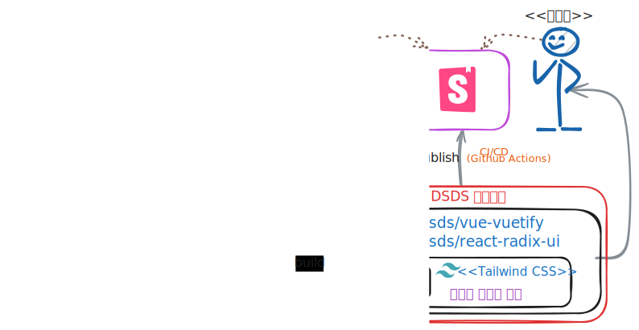

<footer>1. DSDS 개발 라이브러리 소개 > 디자인시스템 정의 > <b>디자인 토큰</b> </footer>

---

### MS Word 문서 작성으로 비유하자면? (정확하지는 않지만)

**스타일**(디자인)은 일종의 **디자인 토큰**입니다.

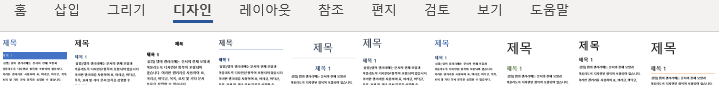
<small class="text-gray">색상 테마, 서체, 간격을 한 곳에서 변경 → 전체 반영</small>


* 그리고, 재사용 가능한 **컴포넌트**도 있습니다: 텍스트, 도형, 표 등
  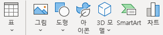
* **레이아웃 규칙**도 있죠: 여백, 정렬, 단 나누기
  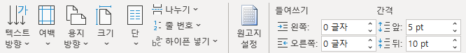
* 하지만 <u>이것만으로 좋은 문서</u>가 만들어질까요?

<footer>1. DSDS 개발 라이브러리 소개 > 디자인시스템 정의 > <b>디자인 시스템의 이해</b> </footer>

---

### 이것만으로는 부족합니다: **디자인 시스템의 목적**

좋은 문서를 만들려면 이런것들도 포함되어야 합니다.

- ✅ 언제 어떤 스타일을 써야 하는지 **사용 지침**
* ✅ 읽기 쉬운 문서 구조를 만드는 **베스트 프랙티스**
* ✅ 팀원들이 규칙을 지키도록 하는 **거버넌스**
* 디자인 시스템도 마찬가지입니다:
  * 컴포넌트를 **언제, 어떻게** 사용할지 명확한 가이드
  * 팀 간 협업을 위한 **공통 언어**와 프로세스
  * 지속적으로 발전시키는 **전담 조직**
  * 이 모든 것이 갖춰져야 **일관되고 효율적인 제품 개발**이 가능합니다.

<footer>1. DSDS 개발 라이브러리 소개 > 디자인시스템 정의 > <b>디자인 시스템의 목적</b> </footer>

---

### 사례: KRDS (Korea 디자인 시스템)

<iframe src="https://www.krds.go.kr/html/site/index.html"></iframe>

---

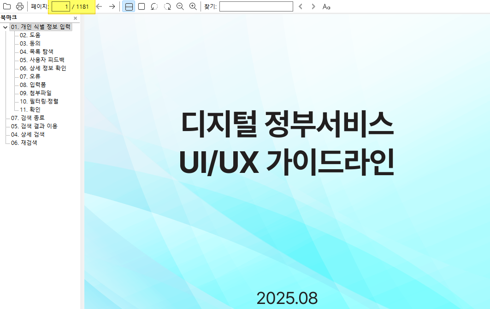

<footer>1. DSDS 개발 라이브러리 소개 > 디자인시스템 정의 > <b>디자인 시스템 사례: KRDS</b> </footer>

---

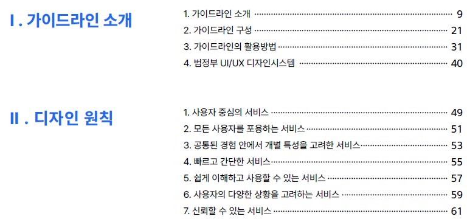

<footer>1. DSDS 개발 라이브러리 소개 > 디자인시스템 정의 > <b>디자인 시스템 사례: KRDS</b> </footer>

---

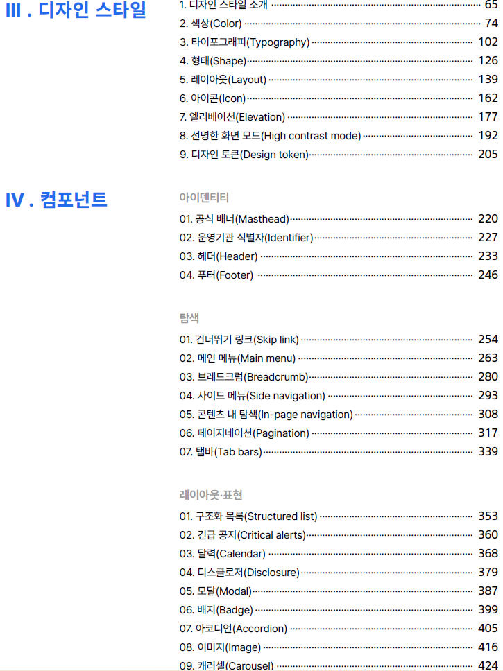

<footer>1. DSDS 개발 라이브러리 소개 > 디자인시스템 정의 > <b>디자인 시스템 사례: KRDS</b> </footer>

---

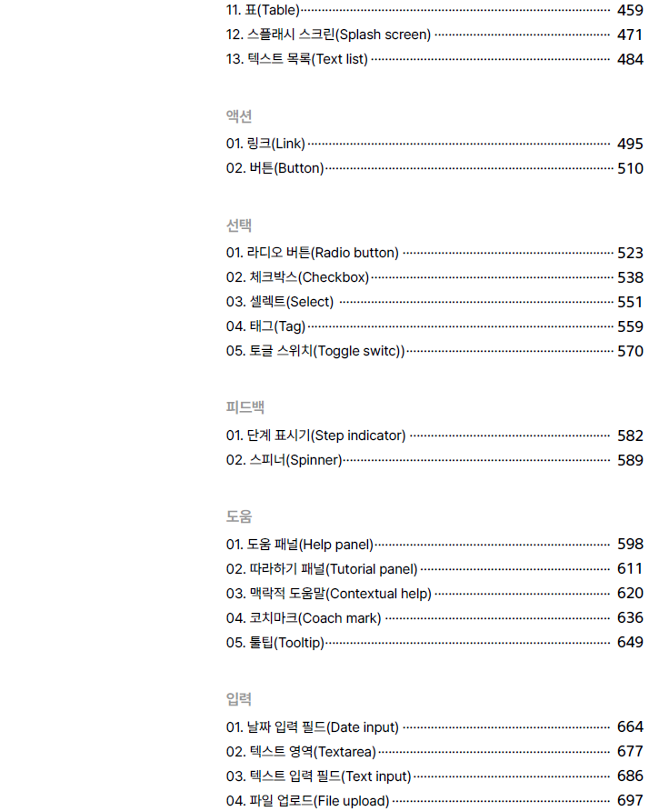

<footer>1. DSDS 개발 라이브러리 소개 > 디자인시스템 정의 > <b>디자인 시스템 사례: KRDS</b> </footer>

---

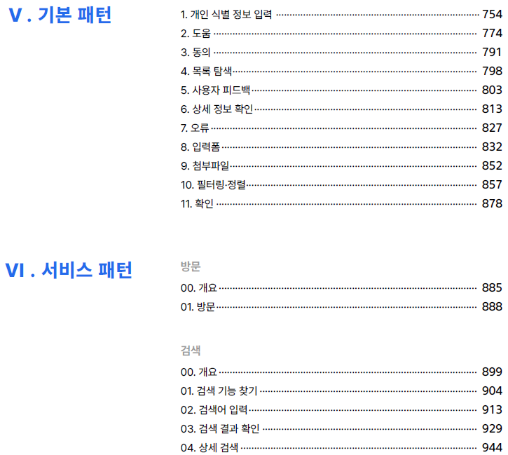

<footer>1. DSDS 개발 라이브러리 소개 > 디자인시스템 정의 > <b>디자인 시스템 사례: KRDS</b> </footer>

---

<style scoped>
img.fixed {
	position: fixed;
	left: 350px;
	z-index: 0;
}
ul, li {
	z-index: 1;
}
</style>

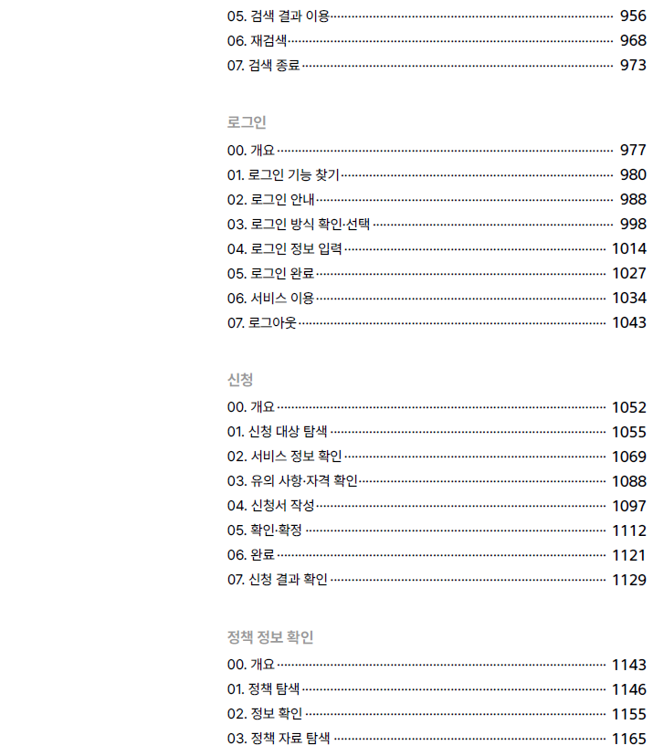

* 💣 이걸 다 읽고 이해해야 할까요?
  - **AI가 최대한 대신해야**합니다.

<footer>1. DSDS 개발 라이브러리 소개 > 디자인시스템 정의 > <b>디자인 시스템 사례: KRDS</b> </footer>

---

#### 사례: DSDS - Figma로 제작중인 DS 디자인 시스템


<footer>1. DSDS 개발 라이브러리 소개 > 디자인시스템 정의 > <b>디자인 시스템 사례: DSDS</b> </footer>

---

<style scoped>
li { margin-top: 10px; }
h3 { margin-bottom: 30px; }
</style>

### **DSDS 개발 라이브러리 목표**

<style scoped>
	blockquote {
		zoom: 80%;
		margin-top: 20px;
	  p { text-align: left; }
	}
</style>

**<u>지속 가능한</u> DSDS 기반 UI 개발 체계 구축 / 적용**

* MES UM 과제(궁극적으로 전사)에서 **공통 활용할 개발 라이브러리의**
* ✅ **지속 가능한** 디자이너/개발자간 **협업 프로세스 및 거버넌스 체계를** 확립.
* ✅ (8/31) **Tier 1 표준 구현 컴포넌트** (21개, React / Vuetify) 초기 버전 개발.
* ✅ (9/30) **2개 대표화면**(PEMS Clean Lot Dashboard, EES UI)에 적용.
* ✅ **설치 가능한 npm 패키지**로 릴리스 <small class="text-gray">(최신 릴리스: 0.3.0-beta)</small>
  - <small class="text-gray">(9/15)</small> **v0.1 알파** <i class="bar"></i> <small class="text-gray">(10/15)</small> **0.2 베타** <i class="bar"></i> (~`26. 3) **1.0 정식출시 예정**
	> ⚠️ **[주의]** `26. 3월 출시될 1.0 정식버전은 DS <u>전사 배포 대상이 아닙니다.</u>
	> - MES팀 내 <u>UM 과제 또는 UM 디자인 호환되는 경우로 제한 합니다.</u>
	> - 반드시 디자인팀이 붙어서 관리될 수 있는 조직에 대해서 사용가능 합니다.
	> <small class="text-gray">(Cozy 모드 지원 가능한 v2.0 (`26. 10월 예정) 버전이 되어야 전사 배포 가능)</small>

<footer>1. DSDS 개발 라이브러리 소개 > <b>목표</b></footer>

---

<style scoped>
	iframe {
		zoom: 66.66666666%;
	}
</style>

### 참고: DSDS 에서 제공하는 Compact 모드의 사례

<iframe src="https://dsds.mwebdev.samsungds.net/storybooks/vue-vuetify/?path=/story/examples-ees-ui-alarmsummary--basic-layout&full=1">
</iframe>

<footer>1. DSDS 개발 라이브러리 소개 > 목표 > <b>Compact 모드 사례</b></footer>

---

#### 참고: [DSDS 표준 개발 라이브러리 레지스트리](https://npm.mwebdev.samsungds.net)

<iframe src="https://npm.mwebdev.samsungds.net">
</iframe>

<footer>1. DSDS 개발 라이브러리 소개 > <b>목표</b></footer>

---

#### 참고: [DSDS Vuetify 스토리북](https://dsds.mwebdev.samsungds.net/storybooks/vue-vuetify)

<iframe src="https://dsds.mwebdev.samsungds.net/storybooks/vue-vuetify">
</iframe>

<footer>1. DSDS 개발 라이브러리 소개 > <b>목표</b></footer>

---
#### 참고: [DSDS Radix UI 스토리북](https://dsds.mwebdev.samsungds.net/storybooks/react-radix-ui)

<iframe src="https://dsds.mwebdev.samsungds.net/storybooks/react-radix-ui">
</iframe>

<footer>1. DSDS 개발 라이브러리 소개 > <b>목표</b></footer>

---


### 지속 가능성

> **이렇게 적은 인력**으로 지속적인 디자인 QA, 컴포넌트 유지보수가 가능할까?

- **디자인 토큰 CI/CD**: 디자인의 핵심 요소 관리 / 개발 자동화.
	- 디자인 토큰: 색상, 서체, 간격 등 의미가 부여된 주요 디자인 값 및 스타일
  - **CI/CD 로** 디자인 **토큰 변경을 코드/스토리북으로 즉시 반영**
  - 디자이너 / 개발자간 소통, 재작업으로 인한 업무 LOSS 효율화
* **테스트 첨단화**: QA 공수 / 시간 / 비용 단축
  - 테스트 자동화: Component / E2E 테스트 / [Visual Regression 테스트](https://dsds.mwebdev.samsungds.net/playwright-reports-temp/react-radix-ui/)
  - 개발 절차에 <u>대표화면 Storybook 필수</u>: UI/UX 테스트와 의사소통 비용 절감
	  (Storybook 셋업 자동화 CLI, 페이지 생성 예제/가이드 제공 예정)

<footer>1. DSDS 개발 라이브러리 소개 > 목표 > <b>지속 가능성</b></footer>

---

#### ❓**깜짝 Q&A**

> UI 개발의 test case 생성 자동화나, test 방법론의 표준화, UI 활용 로그 표준화, UI 활용 분석 계획이 있나요?

- Storybook, Vitest 기반의 Test 방법론 표준화를 만들어나가는 중입니다.
- Test Case 생성 자동화는 아직 계획에 없습니다.
  - 하지만 표준화된 Test 방법론 기반으로 충분히 가능하지 않을까 생각합니다.
- UI 활용 로그 표준화는 UM 과제에서 진행중입니다. (Rum Agent 이용)
  - v1.0 출시까지 DSDS 개발라이브러 레벨에서 지원할 계획 중입니다.

---

### 디자인 토큰 자동화 사례 (with IT UX그룹 이재용님)

1. Figma 에서 Design Token 업데이트
2. 사내 Github Push 및 Github Actions CI/CD
   (보안 이슈 없음, 사내 네트워크 이용)
3. CSS Variables 자동 빌드 및 Storybook 퍼블리싱
4. 메신저 등으로 자동 인폼
5. CI/CD 파이프라인으로 Storybook 산출물 자동 적용

<br />

(➡️ 다음장에 실제 스크린샷 화면을 첨부했습니다.)

<footer>1. DSDS 개발 라이브러리 소개 > 목표 > <b>지속 가능성</b></footer>

---
<style scoped>
	section { padding-top: 0px !important }
</style>


<footer>1. DSDS 개발 라이브러리 소개 > 목표 > <b>지속 가능성</b></footer>

---

## 지원 대상

DSDS 표준 UI 컴포넌트는 다음 Tier 로 지원 레벨을 나눕니다.

**[Tier 1]** : React / Vue용 표준 구현 컴포넌트
* UI 컴포넌트 개발 조직에서 개발/빌드/배포/디자인/검수 전 과정을 책임짐.
* 사내 NPM Repository 에 패키지로 배포하여 `npm install` 로 사용.
* **구현 대상:**
  - React: `@dsds/react-radix-ui` : 레퍼런스 구현
  - Vue: `@dsds/vue-vuetify` : Vuetify 스타일링 및 DS향 컴포넌트 추가
    - 기존 Vuetify 사용법과 최대한 호환: 전환 공수 절감

**[Tier 2]**:  다른 UI 라이브러리 또는 JSP 등으로 구현된 레거시 웹 화면

<footer>1. DSDS 개발 라이브러리 소개 > <b>지원 대상</b></footer>

---
#### 참고: (Tier 1) 기존에 사용중인 컴포넌트 마이그레이션 전략 (Vuetify)

```diff
<script lang="ts">
- import { createVuetify, VuetifyOptions } from 'vuetify'
+ import { createVuetify, VuetifyOptions, VBtn } from '@dsds/vue-vuetify'
/* ... */
<script>

<template>
-	<v-btn variant="outlined" density="compact">button</v-btn>
+	<v-btn variant="secondary">button</v-btn>
</template>
```

<footer>1. DSDS 개발 라이브러리 소개 > <b>지원 대상</b></footer>

---

<style scoped>
iframe {
	zoom: 75%;
}
</style>

### DSDS Vuetify 란?

Vue 에서 가장 많이 사용되고 안정화된 [Vuetify](https://vuetifyjs.com/en/) UI 컴포넌트를 DSDS 향으로 커스텀

<iframe src="https://vuetifyjs.com/en/components/all/#containment">
</iframe>

<footer>1. DSDS 개발 라이브러리 소개 > 지원 대상 > <b>Tier 1: DSDS Vuetify</b></footer>

---

**DSDS Vuetify**
<iframe src="https://dsds.mwebdev.samsungds.net/storybooks/vue-vuetify/?path=/docs/components-button--docs">
</iframe>

<footer>1. DSDS 개발 라이브러리 소개 > 지원 대상 > <b>Tier 1: DSDS Vuetify</b></footer>

---

### 참고: Vuetify Variants 와의 비교

<iframe src="https://vuetifyjs.com/en/components/buttons/#usage">
</iframe>

<footer>1. DSDS 개발 라이브러리 소개 > 지원 대상 > <b>Tier 1: DSDS Vuetify</b></footer>

---

#### 참고: [DSDS Vuetify 설치 방법](https://dsds.mwebdev.samsungds.net/docs/vue/install-guide)

<iframe src="https://dsds.mwebdev.samsungds.net/docs/vue/install-guide">
</iframe>

<footer>1. DSDS 개발 라이브러리 소개 > 지원 대상 > <b>Tier 1: DSDS Vuetify</b></footer>

---

**DSDS Vuetify 설치 CLI 동영상**

`pnpm create @dsds --template=vuetify my-app`


<footer>1. DSDS 개발 라이브러리 소개 > 지원 대상 > <b>Tier 1: DSDS Vuetify</b></footer>


---

### Tier 2 지원 계획

- **디자인 토큰** 기반:  개발 가이드라인 제공, 컨설팅
	- 디자인 토큰(variables css) 적용 방법, 레퍼런스 구현 사례 제공
- **어려운점**: App 별 개별 분석 및 적용 필요
  - 레거시마다 사용하는 JavaScript 라이브러리 가 다 다름
  - 작업 과정을 패턴화해서 **재사용 하기 어려움.**
- **중요 JSP 페이지 우선**: `26년 6월 이후 가능
	- 양산 PEMS PoC 적용 후 타 시스템 확산 예정

<footer>1. DSDS 개발 라이브러리 소개 > 지원 대상 > <b>Tier 2 지원 계획</b></footer>

---

#### ❓**깜짝 Q&A**

> Backend 개발과 Frontend 개발을 분리해서 Front 부분만 다루는 것 같은데요. 우리 회사의 상당수의 Application 은 DB 에 의존적으로, 대부분의 logic이 SQL 로 구현되어 web side에서 개발되는 것 같습니다. 이런 상황을 고려해서 언급해주시면 좋을 것같습니다.

- JSP, Django 등 백엔드에서 화면 렌더링 후 응답 경우라면 **Tier 2 지원**에 해당합니다.
  (Vue / React 등 모던 웹 프레임워크라면 Frontend 가 이미 분리되어있습니다.)
  * 이경우 **디자인 토큰 기반 가이드** 밖에 드릴수가 없습니다.
  * 개발자들은 디자인 시스템 가이드 문서를 읽고 직접 이해해서 구현하셔야 합니다.
  * AI 지원이 어렵고 제한적일 뿐 아니라 ROI가 없습니다.
    - 전문가도 어려운 작업이며, 기술 스택별로 별도 대응해야 합니다.
- 모던 웹 프레임웍 사용중이며, Frontend 코드에 Mingling 된 로직을 걱정하신다면?
  * AI 가 충분히 잘 Mocking & Refactoring 해줍니다. (경험적 으로)
  * 리팩토링 후 진행하시길 권장드립니다.

---

## 개발 현황

### **Design Tokens**

- **Primitive Tokens**: **완료** (대상: 색상, 간격,  효과,  서체 등)
- **Semantic Tokens**: **`26. 3월** 정식 버전까지 완료 목표
  - 대상: 색상,  간격,  서체,  높이 등)
- **Component Tokens**: **`26. 3월** 정식 버전까지 완료 목표
  - 대상: 컴포넌트별 색상,  서체,  간격 정보를 토큰화

> [참고: 디자인 토큰 개념 (KRDS: Korea Design System)](https://www.krds.go.kr/html/site/style/style_07.html)
> [참고 `@dsds/tokens` (디자인 토큰 라이브러리)](https://dsds.mwebdev.samsungds.net/storybooks/tokens)

<footer>1. DSDS 개발 라이브러리 소개 > <b>개발 현황</b></footer>


---

### **Components**

<style scoped>
section { justify-content: center; }
table {
	th {
		font-family: NanumSquareNeoExtraBold;
	}
	th, td {
		font-size: 1.25rem;
		text-align: left;
    white-space: nowrap;
    overflow: hidden;
    text-overflow: ellipsis;
    padding-inline: 10px;
	}
	td {
		& > s {
			color: red;
			text-decoration: none;
			font-family: NanumSquareNeoExtraBold;
		}
		& > strong {
			font-family: NanumSquareNeoExtraBold;
		}
		& > small {
			font-size: 1rem;
			color: #999;
		}
	}
	td:last-child {
		font-size: 1rem;
		width: 400px;
	}
	td:nth-child(4),
	td:nth-child(5),
	{
		text-align: center;
	}
}

h3 {
	margin-bottom: 0px;
}

p {
  text-align: right;
	& > small {
		color: #666;
		font-size: 1rem;
	}
	margin-bottom: 0px;
}
</style>

<small style="text-align: right">**△**: 추가 설계가 필요하거나 디자인 미적용</small>

| 구분         | 그룹       | 컴포넌트명                                 | React    | Vue <small>지원</small> | 비고                        |
| ------------ | ---------- | ------------------------------------------ | -------- | ----------------------- | --------------------------- |
| 기본         | Boxes      | **Textbox** <small>(Input)</small>         | O        | O                       |                             |
| │            | │          | **Searchbox**                              | O        | O                       | Textbox + 돋보기 아이콘     |
| │            | │          | <i>Selectbox</i>                           | .        | .                       | Select 참고                 |
| │            | └          | <i>Calbox</i>                              | .        | .                       | DatePicker 참고             |
| │            |            | **Buttons**                                | O        | O                       | 6가지 Variant               |
| │            |            | **Checkbox**                               | O        | O                       |                             |
| │            |            | **Radio**                                  | O        | O                       |                             |
| │            |            | **Toggle**                                 | O        | O                       |                             |
| │            |            | **Tag**                                    | O        | O                       |                             |
| │            |            | **Badge**                                  | O        | O                       |                             |
| │            |            | **Loader**                                 | <s>X</s> | O                       |                             |
| │            | Select     | **Select**                                 | <s>X</s> | O                       | multi, showAll variant 포함 |
| └            | └          | **Combobox** <small>(Autocomplete)</small> | <s>X</s> | O                       | multi, showAll variant 포함 |
| 고급         | DatePicker | **DatePicker**                             | **△**    | O                       | React: UM 스타일 적용 중    |
| │            | │          | **DateRangePicker**                        | **△**    | O                       | .                           |
| │            | │          | **RichTextEditor**                         | **X**    | O                       | .                           |
| │            | │          | **Markdown**                               | **X**    | O                       | .                           |
| └            | └          | **ScrollArea**                             | O        | O                       |                             |
| Datatable    |            | **RealGrid**                               | **△**    | O                       | 스타일/패턴으로 지원        |
| │            |            | **Table**                                  | **△**    | **△**                   | DSDS 스타일만 지원          |
| └            |            | **ScrollableTable**                        | **△**    | O                       |                             |
| Popover      |            | **Popover**                                | O        | O                       | Vuetify: `v-menu` 로 구현   |
| │            |            | **Dropdown Menu**                          | O        | O                       | Vuetify: `v-menu` 로 구현   |
| │            |            | **Modal**                                  | O        | O                       |                             |
| │            |            | **Toast**                                  | O        | O                       |                             |
| │            |            | **Tooltip**                                | O        | O                       |                             |
| └            |            | **Toggletip**                              | O        | O                       | Vuetify: `v-menu` 로 구현   |
| Layout / Nav |            | **Header**                                 | O        | O                       |                             |
| │            |            | **Footer**                                 | O        | O                       |                             |
| │            |            | **LNB**                                    | O        | O                       |                             |
| │            | Form       | **Form**                                   | <s>X</s> | O                       |                             |
| │            | │          | **FormField**                              | <s>X</s> | O                       | md, lg                      |
| │            | └          | **FormLabel**                              | <s>X</s> | O                       |                             |
| │            |            | **Tabs**                                   | O        | O                       |                             |
| │            |            | **Pagination**                             | O        | O                       |                             |
| │            | Page       | **Page**                                   | **△**    | O                       | 설계/구현 정교화 중         |
| │            | │          | **PageHeader**                             | **△**    | O                       | │                           |
| │            | │          | **PageBody**                               | **△**    | O                       | │                           |
| │            | │          | **PageDivider**                            | **△**    | O                       | │                           |
| │            | └          | **PageHeaderFilter**                       | **△**    | O                       | └                           |
| │            | Dialog     | **Dialog**                                 | O        | O                       |                             |
| │            | │          | **DialogHeader**                           | <s>X</s> | O                       |                             |
| │            | └          | **DialogPanel**                            | <s>X</s> | O                       |                             |
| └            |            | **Card**                                   | **△**    | **△**                   | 설계중                      |

<footer>1. DSDS 개발 라이브러리 소개 > 개발 현황 > <b>Components</b></footer>

---

<style scoped> section { justify-content: center; } </style>

# 2. 개발 가이드 및 적용 사례 소개

> [참고자료]
> - [DSDS Vue / Vuetify 스토리북 사례](https://dsds.mwebdev.samsungds.net/storybooks/vue-vuetify/?path=/story/examples-ees-ui-alarmsummary--basic-layout)
> - [DSDS React / Radix UI 스토리북 사례](https://dsds.mwebdev.samsungds.net/storybooks/react-radix-ui/?path=/story/layouts-sdp-examples--sdpsrs-layout)
> - [DSDS Github 레포지터리](https://github.samsungds.net/dsds/dsds)
> - [(UM 보고자료) PEMS 표준 UX 적용 현황](https://confluence.samsungds.net/spaces/MESUXModernization/pages/2848715686/3.+PEMS+-+%ED%91%9C%EC%A4%80+UX+%EC%A0%81%EC%9A%A9+%EC%A7%84%ED%96%89+%ED%98%84%ED%99%A9)

---

## 개발 가이드

### 이상적인 프로세스
- UM 디자인 요청 -> 시안 받기 -> 레이아웃 전처리 작업
	- -> 스토리북 생성 -> 대표 화면 Fine Tuning / QA검수 완료
	- -> 유사화면은 개발자가 작업 (스토리북 작업 포함)
	- -> 스토리북으로 QA완료

<footer>2. 개발 가이드 및 PEMS 적용 사례 > <b>이상적인 프로세스</b></footer>

---

### PlanB : UM 디자인 없을 경우 (PoC 또는 빠른 선개발 필요시)

- 스토리북 생성 동일. Vuetify 컴포넌트로 화면 구성
  - 협업 필요: 반복되는 패턴을 캡슐화 하기 위함
- 화면 구성하다 UM 개발라이브러리 없는 컴포넌트 발생시
  - 기존 Vuetify 컴포넌트에 있을 경우
    - Vuetify 컴포넌트 그냥 사용 (Density=Compact)
    - UM 비슷하게 룩앤필 패치한 후 사용가능하게 배포, 디자인 긴급 시안요청
    - 1~2주 안에 UM 디자인 시안 나오면 사용법 그대로 디자인만 마이그레이션
  - 기존 Vuetify 컴포넌트에 없을 경우
    - 문의: 김용기님(`yongki82.kim`) 메일 또는 [Github Issue](https://github.samsungds.net/dsds/dsds/issues)
    - 컴포넌트 선정부터 협의 필요

<footer>2. 개발 가이드 및 PEMS 적용 사례 > <b>Plan B: 예외 케이스</b></footer>

---

## 개발 및 적용 사례 1: 이미 Vuetify로 개발된 **기존 화면 마이그레이션**

**PEMS Clean Lot Dashboar**d

1. UM 디자인 전: PI / 개발자가 직접 화면 설계하여 먼저 구현
2. UM 디자인 시안 개발 및 전달
3. 마이그레이션 할 **대표화면** 선정
4. UM 디자인 시안 와이어프레임 레이아웃을 개발자가 맞춤
5. 스토리북 생성. 대표 화면을 DSDS Vuetify 표준 컴포넌트로 교체
	1. 교체중에 반복되는 패턴은 PageHeader / PageDivider 등으로 캡슐화
6. 대표화면 스토리북을 바탕으로 화면 담당자가 유사 화면을 UM 디자인으로 전환
7. 대표화면 스토리북 QA완료

<footer>2. 개발 가이드 및 PEMS 적용 사례 > <b>PEMS 적용 사례</b></footer>

---

**PI / 개발자가 직접 화면 설계한 화면**
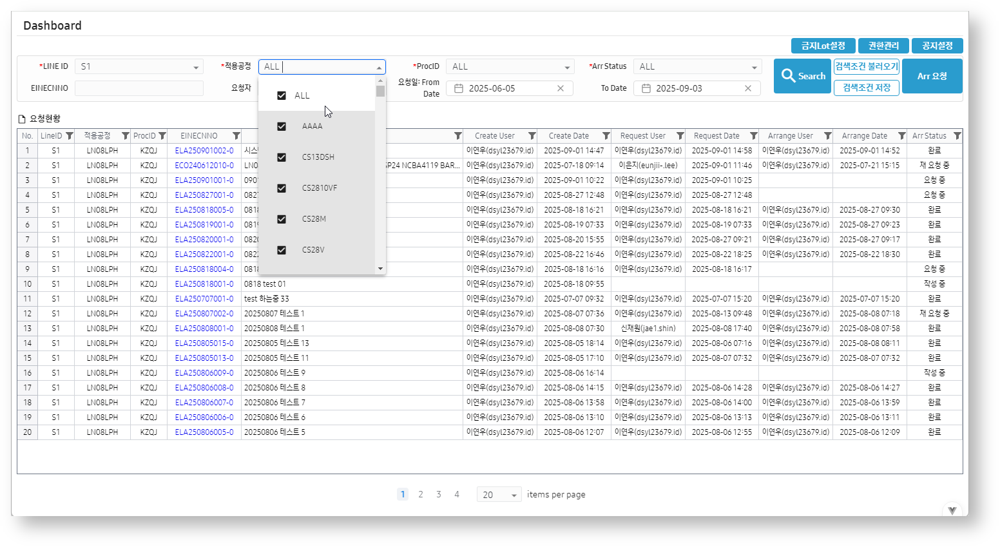

<footer>2. 개발 가이드 및 PEMS 적용 사례 > <b>PEMS 적용 사례</b></footer>

---

**UM 디자인 시안**
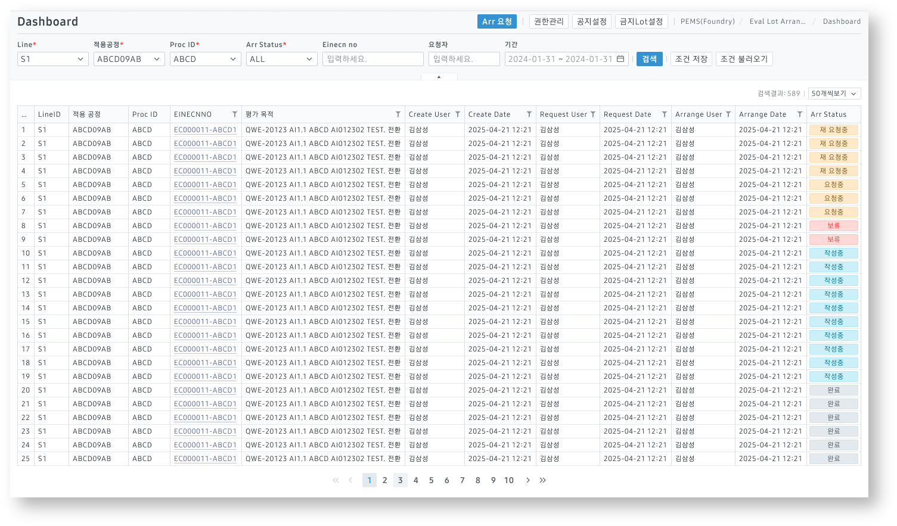

<footer>2. 개발 가이드 및 PEMS 적용 사례 > <b>PEMS 적용 사례</b></footer>

---

**화면 담당자(개발자)가 UM 디자인 시안 레이아웃 맞춘 결과**
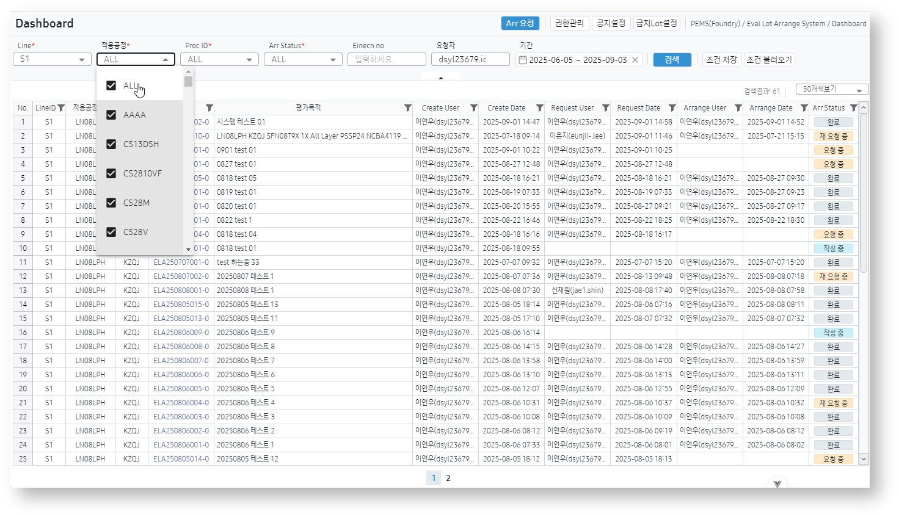

<footer>2. 개발 가이드 및 PEMS 적용 사례 > <b>PEMS 적용 사례</b></footer>

---

**DSDS Vuetify 표준 컴포넌트로 개선한 최종화면 ([스토리북](https://dsds.mwebdev.samsungds.net/storybooks/vue-vuetify/?path=/story/examples-pems-common--clean-lot-dashboard))**
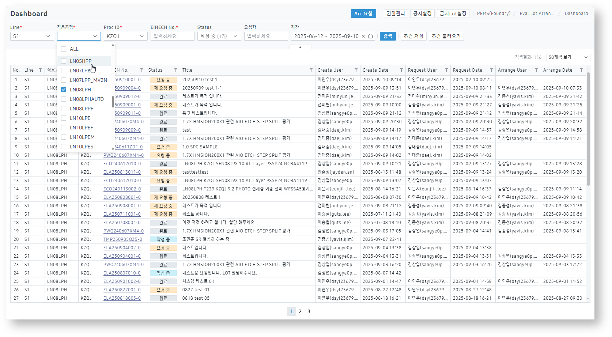

<footer>2. 개발 가이드 및 PEMS 적용 사례 > <b>PEMS 적용 사례</b></footer>

---

**UM 디자인 시안과 비교**


<footer>2. 개발 가이드 및 PEMS 적용 사례 > <b>PEMS 적용 사례</b></footer>

---

### Vuetify 호환성

**기존 Vuetify 코드 그대로 전환 가능합니다**
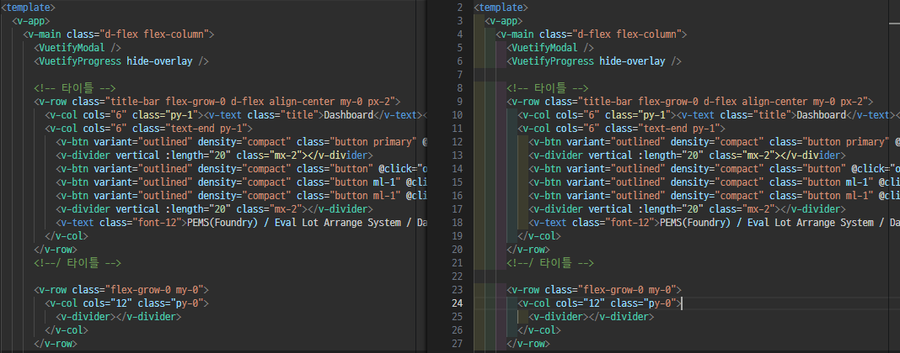


<footer>2. 개발 가이드 및 PEMS 적용 사례 > PEMS 적용 사례 > <b>Vuetify 호환성</b></footer>

---

### Vuetify 호환성 (계속)

**하지만 다음과 같이 DSDS 에 맞게 리팩토링 하길 권장합니다.**
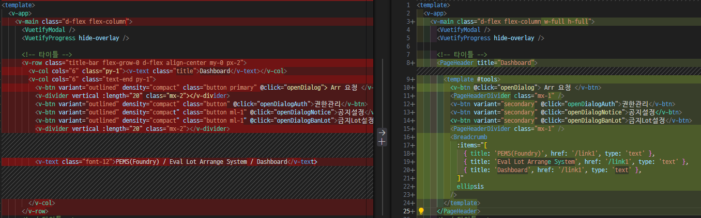

<footer>2. 개발 가이드 및 PEMS 적용 사례 > PEMS 적용 사례 > <b>Vuetify 호환성</b></footer>

---

## 개발 및 적용 사례 2: **Vue: 타 프레임웍으로 개발된 앱의 경우**

**EES-UI**

- Vuetify 가 아닌 Bootstrap 으로 개발되어 기존 화면 전환 불가합니다.
- 스토리북으로 목업파일 생성하여 전달하는 방식으로 진행 중입니다.

---

### Bootstrap 기반 기존 개발 코드
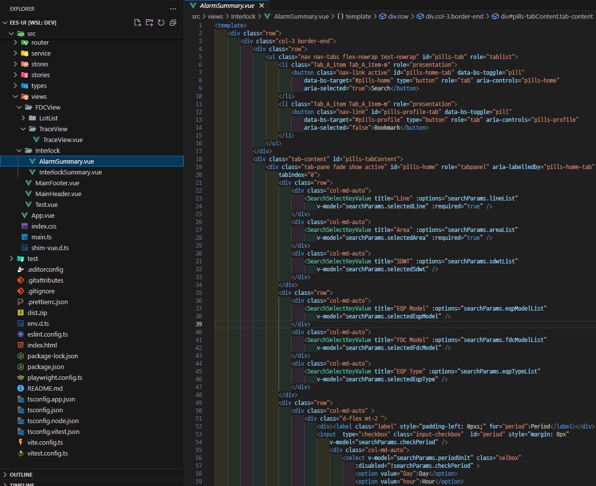

---

### 기존 코드로 구현된 화면

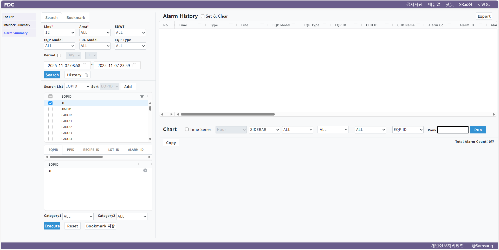

---

### Figma 디자인

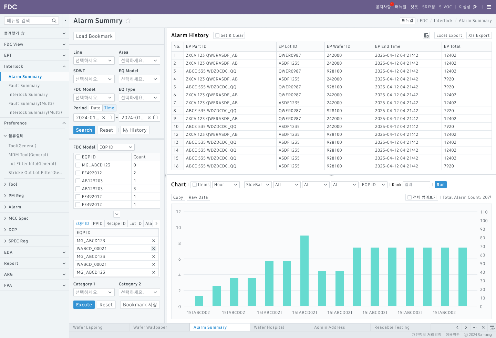

---

### `@dsds/vue-vuetify` 기반 목업 스토리북과 코드

<iframe src="https://dsds.mwebdev.samsungds.net/storybooks/vue-vuetify/?path=/story/examples-ees-ui-alarmsummary--basic-layout&full=1">
</iframe>

---

### 개선 전/후 비교

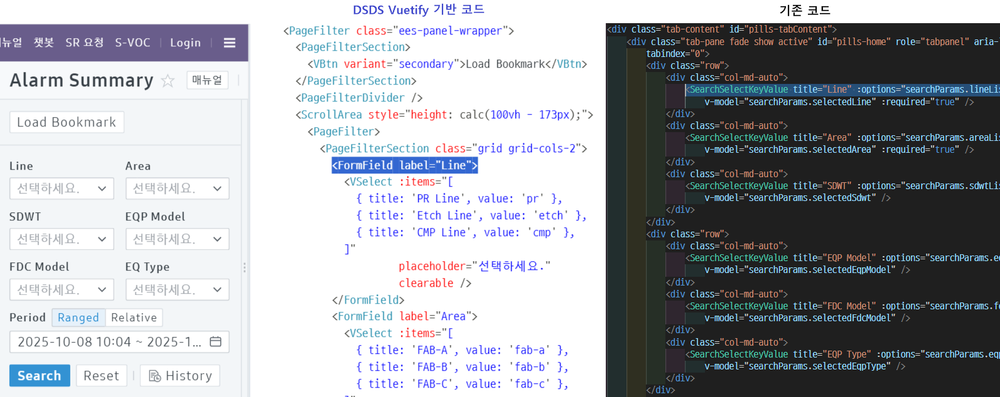
- 논리적인 레이아웃 / 페이지 / 폼 단위로 리팩토링
- 컴포넌트가 알아서 DSDS 스타일 구현 (커스텀 스타일 공수 최소화)

---

<style scoped> section { justify-content: center; } </style>

---

# 4. AI 적용 로드맵

<iframe src="https://dsds.mwebdev.samsungds.net/docs/slides/20250709-how-to-agentic-ui.html">
</iframe>

---

### 사례: DSDS React / Radix-UI MCP 서버

<iframe src="https://dsds.mwebdev.samsungds.net/storybooks/react-radix-ui/?path=/docs/getting-started-mcp-server--docs">
</iframe>

---

### 사례: (문서화) DSDS Vue / Vuetify : 화면 구성 가이드

<iframe src="https://dsds.mwebdev.samsungds.net/storybooks/vue-vuetify/?path=/docs/layouts-overview--docs">
</iframe>

---

# 4. 결론 및 당부사항

---

## 결론 및 당부사항

### DSDS Vuetify 는 개발 효율을 높여줍니다.

- DSDS Vuetify를 통히 Vue 용 웹 화면에 UM 표준을 쉽게 적용할 수 있습니다.
- Vue에서 가장 널리 쓰이고 사내에서 충분히 검증된 Vuetify를 기반으로 합니다.
- Vuetify 와 API 레벨로 호환성을 맞춰 기존 사용자도 쉽게 전환 가능합니다.
- DSDS를 Pixel Perfect 하게 준수하므로 컴포넌트 단위의 QA가 필요없습니다.
- DS 디자인 시스템 / 컴포넌트 변경에 쉽게 대응할 수 있습니다.
- 릴리스 일정: (~10/15) **0.2 베타** <i class="bar"></i> (~`26. 3) **1.0 정식 버전**

<footer>34. 결론 및 당부사항<footer>

---

<br/>

### DSDS Vuetify는 전사 배포용이 아니며 UM 과제 용으로 사용이 제한됩니다.

- DSDS Vuetify 는 기본적으로 <u>**MES UM 과제에 한해서만 사용 가능**</u>합니다.
  - <u>**UM 호환(Compact / Light 모드) 레이아웃만 지원**</u>합니다.
  - UM 과제 아니라면 <u>**IT UX 디자이너와 협업 가능해야**</u> 합니다.
- 개발 전 **DSDS 디자이너 및 개발팀에 문의하세요**
  - 수신: 김용기님(`yongki82.kim`), 조무영님(`mercy.cho`)
  - 참조: 이재용님(`jyteneo.lee`), 김지연 파트장님(`jy0208.kim`)

<footer>4. 결론 및 당부사항<footer>

---

<br/>

### DSDS Vuetify 적용은 다음과 같은 프로세스로 진행됩니다.

1. DSDS 개발팀에 연락해주세요: 대표화면 선정, 개발 및 QA 일정등 협의
2. Github Repository Clone/Push 권한을 주세요
3. Storybook 및 CI/CD Github Action 을 만들어드립니다.
4. 디자이너/개발자와 소통할 수 있는 Mattermost 채널에 초대해드립니다.
5. 스토리북으로 대표화면을 구현하여 가이드와 함께 전달드립니다.
6. 구현된 대표화면을 따라 유사 화면을 구현합니다 (스토리북 페이지 포함)
7. (디자이너 참여시) 대표화면으로 QA를 진행합니다.

<footer>4. 결론 및 당부사항<footer>

---

## 참고자료

- [DSDS 포탈 (개발중. Next.js)](https://dsds.mwebdev.samsungds.net)
- [DSDS React Radix-UI 스토리북](https://dsds.mwebdev.samsungds.net/storybooks/react-radix-ui)
- [DSDS Vuetify 스토리북](https://dsds.mwebdev.samsungds.net/storybooks/vue-vuetify)
- [DSDS Github 레포지터리](https://github.samsungds.net/dsds/dsds)

<footer>3. 결론 및 당부사항<footer>

---

<style scoped> section, h1, h2 { justify-content: center; text-align: center; } </style>

# **감사합니다.**

## Q&A


---

<style scoped> section { justify-content: center; } </style>

# 부록. 지속가능한 UI 컴포넌트 거버넌스 및 개발 프로세스

---

## 디자이너 / 개발자 협업을 위한 표준 개발 거버넌스


---

# UI 컴포넌트 개발 거버넌스

### 중앙 집중식 거버넌스란?

- **IT UX 개발 그룹** 및 **컴포넌트 개발리더 조직이** <br/>전사 UI 컴포넌트의 개발/관리/검수를 중앙에서 전담 관리
* **타당성(Rationale)**:  **전사 UI 표준을 일관적/효율적 으로 관리 가능**
	(+ 빠른 초기 개발: *전사 어플리케이션 개발 조직의 UI 컴포넌트 기술 역량이 상이*)
* **문제점**: **지속 가능 여부** - 개발 / 검수 부하가 중앙에 집중됨
	* **해결방안**: 디자인 토큰 기반 디자이너/개발자 협업 프로세스 및 자동화 체계 구축
		* **공격적 자동화**: 가능한 모든 부분에 CI/CD 적용.
		* **테스트 첨단화**: E2E 테스트, Visual Regression 테스트 등
		* **재사용 패키지**: 가능한 모든 산출물을 패키지화

---

## 디자인 토큰 기반 디자이너/개발자 협업 프로세스


---

## 디자인 토큰 기반 디자이너/개발자 협업 프로세스

- **목적**
	- 지속 가능한, 빠르고 효율적인 디자인/개발자 업무 협업을 위한 체계 구성
* **이유**: 최소의 인력/비용으로 디자인 시스템 기반 방대한 UI 변경에 대응하기 위함.
* **방법**:
	- 디자인 토큰 기반으로 디자인의 핵심 요소 관리.
	* CI/CD 로 디자인 토큰 변경을 코드/스토리북으로 즉시 반영
	* 디자이너 / 개발자간 소통, 재작업으로 인한 업무 LOSS 효율화

