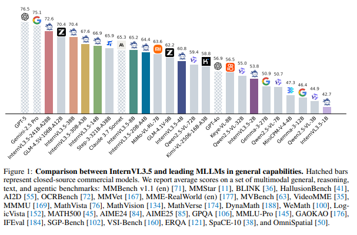

<style>

.bespoke-marp-osc {
	margin-bottom: -50px !important;
}


@font-face {
    font-family: 'D2Coding';
    src: url('https://cdn.jsdelivr.net/gh/projectnoonnu/noonfonts_three@1.0/D2Coding.woff') format('woff');
    font-weight: normal;
    font-display: swap;
}

@font-face {
    font-family: 'NanumSquareNeoLight';
    src: url(https://hangeul.pstatic.net/hangeul_static/webfont/NanumSquareNeo/NanumSquareNeoTTF-aLt.eot);
    src: url(https://hangeul.pstatic.net/hangeul_static/webfont/NanumSquareNeo/NanumSquareNeoTTF-aLt.eot?#iefix) format("embedded-opentype"), url(https://hangeul.pstatic.net/hangeul_static/webfont/NanumSquareNeo/NanumSquareNeoTTF-aLt.woff) format("woff"), url(https://hangeul.pstatic.net/hangeul_static/webfont/NanumSquareNeo/NanumSquareNeoTTF-aLt.ttf) format("truetype");
}

@font-face {
    font-family: 'NanumSquareNeo';
    src: url(https://hangeul.pstatic.net/hangeul_static/webfont/NanumSquareNeo/NanumSquareNeoTTF-bRg.eot);
    src: url(https://hangeul.pstatic.net/hangeul_static/webfont/NanumSquareNeo/NanumSquareNeoTTF-bRg.eot?#iefix) format("embedded-opentype"), url(https://hangeul.pstatic.net/hangeul_static/webfont/NanumSquareNeo/NanumSquareNeoTTF-bRg.woff) format("woff"), url(https://hangeul.pstatic.net/hangeul_static/webfont/NanumSquareNeo/NanumSquareNeoTTF-bRg.ttf) format("truetype");
}

@font-face {
    font-family: 'NanumSquareNeoBold';
    src: url(https://hangeul.pstatic.net/hangeul_static/webfont/NanumSquareNeo/NanumSquareNeoTTF-cBd.eot);
    src: url(https://hangeul.pstatic.net/hangeul_static/webfont/NanumSquareNeo/NanumSquareNeoTTF-cBd.eot?#iefix) format("embedded-opentype"), url(https://hangeul.pstatic.net/hangeul_static/webfont/NanumSquareNeo/NanumSquareNeoTTF-cBd.woff) format("woff"), url(https://hangeul.pstatic.net/hangeul_static/webfont/NanumSquareNeo/NanumSquareNeoTTF-cBd.ttf) format("truetype");
}

@font-face {
    font-family: 'NanumSquareNeoExtraBold';
    src: url(https://hangeul.pstatic.net/hangeul_static/webfont/NanumSquareNeo/NanumSquareNeoTTF-dEb.eot);
    src: url(https://hangeul.pstatic.net/hangeul_static/webfont/NanumSquareNeo/NanumSquareNeoTTF-dEb.eot?#iefix) format("embedded-opentype"), url(https://hangeul.pstatic.net/hangeul_static/webfont/NanumSquareNeo/NanumSquareNeoTTF-dEb.woff) format("woff"), url(https://hangeul.pstatic.net/hangeul_static/webfont/NanumSquareNeo/NanumSquareNeoTTF-dEb.ttf) format("truetype");
}

h1, h2 { font-family: NanumSquareNeoExtraBold }

section > ul { 	margin-bottom: 5px; }

p:has(img) { text-align: center; }

iframe {  border: 1px solid silver; zoom: 100%; height: 100%; }

code {
  font-family: D2Coding;
}

a:hover, u {
	text-decoration: underline;
	text-underline-offset: 0.5rem;
}

section {
  padding-top: 50px;
  user-select: none;
  font-family: NanumSquareNeo, sans-serif;
  font-size: 1.8rem;
  letter-spacing: 0.5px;
  display: flex;
  flex-direction: column;
  justify-content: start;
}

i.bar {
	min-width: 1px;
	max-width: 1px;
	padding-inline: 1px;
	margin-left: 6px;
	margin-right: 12px;
	background-color: #ccc;
}

.text-gray { color: gray; }

footer {
	background-color: rgba(255, 255, 255, 0.5);
	& > b {
		font-family: NanumSquareNeoExtraBold;
	}
}

</style>

<style scoped> * { text-align: center } section { justify-content: center; } </style>


# UI Automation Studio
### Vision AI 기반 자율 테스트 생성 플랫폼

**"AI가 화면을 이해하고 스스로 테스트를 설계하는 시대"**

## **김용기**

<yongki82.kim@samsung.com>

### 2025. 11. 13

---

##  도전: UI 테스트 자동화의 3대 난제

### 1. **의미 인식의 벽 (Semantic Understanding Gap)**

**기존 한계:**
- Selenium/Playwright: CSS Selector 기반 → 픽셀 위치만 인식
- Accessibility Tree: HTML 구조 의존 → 시각적 맥락 부재
- Record & Replay: 기계적 반복 → 의도 파악 불가

**진짜 문제:**

```
"파란색 버튼"을 클릭하라 (인간의 지시)
  vs
"button.btn-primary[data-testid='submit']"를 찾아라 (기계의 코드)
```

→ **인간은 "의미"로 보고, 기계는 "구조"로 본다**

---

### 2. **컨텍스트 부재의 한계 (Context-Free Testing)**

**전통적 테스트 작성:**

```tsx
test('Add to Cart', async ({ page }) => {
  await page.click('.btn-add');  // 왜 이 버튼을 누르는가?
  await page.click('.btn-checkout');  // 전제 조건은 무엇인가?
  // 테스트 코드는 비즈니스 로직을 모른다
});
```

**결과:**

- 엣지 케이스 놓침 (특이 입력 조건, 권한 없음 등)
- 회귀 시 의미없는 실패 (버튼 색상만 바뀌어도 실패)
- 유지보수 지옥 (화면 변경 → 전체 재작성)

---

### 3. **상태 복원의 복잡성 (State Management Hell)**

**문제 시나리오:**

```
테스트 A: 로그인 → 제품 검색 → DB 오염
테스트 B: 장바구니 추가 → A의 영향으로 실패
```

**기존 해결책의 한계:**

- DB 롤백: 느리고 복잡
- Mock API: 실제 환경과 괴리
- 매번 초기화: 테스트 시간 폭증

---

<style scoped>
  marp-pre { zoom: 80%; }
</style>

## 기술적 돌파구: 3가지 핵심 솔루션

### 돌파구 1: **Vision-Language Fusion Architecture**

**핵심 아이디어:**
화면을 "이미지 + 텍스트"의 멀티모달로 이해하고, 비즈니스 맥락과 결합

```
┌──────────────────────────────────────────┐
│ 입력: 스크린샷 + 매뉴얼 PDF + 사용자 질의 │
└────────┬─────────────────────────────────┘
 ┌───────▼──────────────┐
 │ SOTA OSS Vision Model│ ← 최대 92% GUI 요소 인식
 │   (Multimodal)       │
 └───────┬──────────────┘  ┌ "파란 버튼"-> bbox 좌표(픽셀-> 의미 매핑)
         │     ┌────────────────────┐     ┌────────────────────────┐
         └────>│ Semantic Grounding │────>│ Context-Aware Reasoner │ ← UI 매뉴얼 학습
               │  (Set-of-Mark)     │     │   (LangChain Agent)    │  "매뉴얼로 화면 이해 향상"
               └────────────────────┘     └──────────────┬─────────┘
                                                         │   ┌─────────────────┐
                                                         └──>│ Test Scenario   │
                                                             │  Generation     │
                                                             └─────────────────┘
```

---

<style scoped>
  marp-pre { zoom: 80%; }
</style>

**차별점:**

1. **Set-of-Mark 프롬프팅**: 스크린샷에 번호 오버레이 → vLLM이 정확한 좌표 반환
2. **도메인 지식 주입**: 매뉴얼을 RAG로 학습
3. **테스트 의도를 보존하는 변환**:
   - "사용자가 제품을 검색한다" → Playwright 코드 자동 생성

**실제 코드 예시:**
```typescript
// AI가 생성하는 코드
const scenario = await visionLLM.analyze({
  screenshot: './product-page.png',
  manual: './user-guide.pdf',
  query: '재고가 없을 때의 동작 테스트'
});

// 출력:
// {
//   element: "button[aria-label='장바구니 담기']",
//   condition: "재고 > 0",
//   edgeCase: "재고 = 0 시 비활성화 검증"
// }
```

---

<style scoped>
  marp-pre { zoom: 80%; }
</style>

### 돌파구 2: **Immutable HAR Fixture + Context Isolation**

**핵심 아이디어:**
네트워크 요청/응답을 "타임캡슐"로 저장하고, 각 테스트는 완전히 독립된 우주에서 실행
1. **Zero Network Dependency**: HAR 재생으로 외부 API 불필요
2. **Perfect Reproducibility**: 6개월 전 테스트를 오늘 똑같이 재현
3. **Parallel Execution**: 각 테스트가 독립적 → 무제한 병렬 실행

**Playwright의 Context Isolation 활용:**

```
Context A (Cookie, LocalStorage, Session)
  ├─ Test 1: Login → Search
  └─ Context 종료 → 메모리 완전 삭제

Context B (완전히 새로운 메모리 공간)
  ├─ Test 2: Add to Cart
  └─ Context 종료
```

→ **"시간 여행 가능한 테스트"**

---

**작동 원리:**

```tsx
// 1단계: 초기 Fixture 생성 (단 1회)
const initialFixture = await captureNetworkState({
  url: 'https://example.com',
  scenarios: ['로그인', '제품 조회', '장바구니 추가']
});
// → initial.har 파일 생성 (모든 XHR/Fetch 포함)

// 2단계: 각 테스트는 독립된 Context에서 실행
test('시나리오 A: 검색', async ({ browser }) => {
  const context = await browser.newContext({
    recordHar: { path: './scenario-A.har' }
  });

  await context.routeFromHAR('./initial.har', {
    update: false  // 읽기 전용
  });

  const page = await context.newPage();
  // 테스트 실행...

  await context.close();  // ← 상태 완전 소멸
});

test('시나리오 B: 결제', async ({ browser }) => {
  // 완전히 새로운 Context (A의 영향 0%)
  const context = await browser.newContext();
  await context.routeFromHAR('./initial.har');  // 동일한 초기 상태
  // ...
});
```


---

### 돌파구 3: **Golden Master Pattern with Visual Diff Engine**

**핵심 아이디어:**
초기 실행을 "진실의 기준(Golden Master)"으로 저장하고, 이후 실행과 전체 비교

#### 전통적 Assertion의 한계:

```js
// 개발자가 예상한 것만 검증
expect(page.locator('.count')).toHaveText('1');
expect(response.status()).toBe(200);

// 놓치는 것:
// - 버튼 색상 변경
// - 폰트 크기 조정
// - API 응답 필드 추가/삭제
// - 레이아웃 깨짐
```
---

#### Golden Master 접근:

```typescript
// 1단계: Golden Master 생성
const goldenMaster = {
  screenshot: Buffer,  // 전체 화면 캡처
  dom: HTMLString,     // DOM 구조
  network: [{          // 모든 API 호출
    url: '/api/products',
    status: 200,
    body: { items: [...] }
  }],
  performance: {       // 성능 메트릭
    FCP: 1.2,
    LCP: 2.3
  }
};

// 2단계: 회귀 테스트 (자동)
const currentExecution = await runScenario();

const diff = await compare(goldenMaster, currentExecution);
// → Visual Diff (픽셀 단위 비교)
// → DOM Diff (구조 변경 감지)
// → Network Diff (API 응답 차이)
// → Performance Diff (속도 저하 감지)
```
---

<style scoped>
  marp-pre { zoom: 80%; }
</style>

**Playwright Visual Testing 통합:**

```tsx
test('Product Page Regression', async ({ page }) => { // 자동 생성되는 테스트 코드
  await page.goto('https://example.com/product/123');

  await expect(page).toHaveScreenshot('golden-master.png', { // Golden Master와 자동 비교
    maxDiffPixels: 100,  // 100픽셀 이하 변화 허용
    threshold: 0.2       // 20% 유사도 임계값
  });

  const domSnapshot = await page.content();
  expect(domSnapshot).toMatchSnapshot('golden-dom.html'); // DOM 구조 비교

  const apiResponse = await page.waitForResponse('**/api/products');
  expect(apiResponse.json()).toMatchSnapshot('golden-api.json'); // API 응답 비교
});
```

**차별점:**

1. **Comprehensive Coverage**: 명시적 Assertion 없이도 모든 변화 감지
2. **Visual Regression**: 디자인 변경을 픽셀 단위로 추적
3. **Self-Documenting**: Golden Master 자체가 "살아있는 명세서"

---
<style scoped>
  table { zoom: 80%; overflow-y: hidden }
</style>

## 3가지 기술의 시너지 효과

**통합 워크플로우:**

```
Vision LLM (의미 이해)               : "로그인 후 제품 구매"
  -> HAR Fixture (상태 복원)         : 초기 상태에서 시나리오 실행
     -> Golden Master (전체 레코딩)  : 이후 회귀 테스트 시 자동 비교
```
**실제 효과**

| 전통적 방식            | UI Automation Studio        |
| :--------------------- | :-------------------------- |
| CSS Selector 손수 작성 | Vision AI가 자동 인식       |
| Mock API 개별 구성     | HAR Fixture 자동 생성       |
| 명시적 Assertion 작성  | Golden Master 자동 비교     |
| 테스트 간 의존성 관리  | Context Isolation 자동 격리 |
| UI 변경 시 전체 수정   | AI가 변경 감지 후 제안      |


---

## 기술적 도전과 학습의 기회

1. **Vision LLM의 한계**
   - 작은 UI 요소(11px 미만) 인식률 저하, 동적 콘텐츠 처리 어려움
   - **학습 기회:** Set-of-Mark, OmniParser 등 보조 기술 적용
2. **Context Understanding의 깊이**
   - 매뉴얼의 암묵적 지식 추출, 비즈니스 규칙의 자동 추론
   - **학습 기회:** RAG, Knowledge Graph 구축 노하우
3. **Golden Master의 노이즈**
   - 레이블, 타임스탬프 등 무관한 변화, 허용 가능한 차이와 실제 버그 구분
   - **학습 기회:** Semantic Diff 알고리즘 연구

---

### **실패하더라도 얻는 자산:**

**기술적 성과:**

- Multimodal AI 통합 파이프라인
- Playwright 고급 활용 패턴
- HAR 기반 테스트 방법론

**조직적 역량:**

- AI 기술 내재화
- 자동화 문화 확산

→ **성공/실패 무관하게 기술 부채 감소**

---

## 우리의 전략적 위치

### 왜 지금인가?

- **OSS Vision Model의 부상**
  - InternVL 3.5 (`25 8월) : 38B 모델이 Claude Sonnet 3.7 이상 성능


---

### 왜 우리인가?

- **Full-stack 역량**: React + TypeScript + Node.js
- **AI 활용 경험**: 사내 LLM 프로젝트 다수
- **도메인 전문성**: 실제 테스트 pain point 이해

&nbsp;
> → **모든 퍼즐 조각이 준비됨**

---

## PoC 마일스톤

### Phase 1 (2개월): 기술 검증

**목표:** 1개 화면에서 완전 자동화

- 🔲 OSS Vision API 연동 및 정확도 측정
- 🔲 HAR Fixture 생성/재생 검증
- 🔲 기본 시나리오 생성 성공

**성공 기준:** 사람 개입 없이 테스트 1개 생성 및 실행

---

### Phase 2 (1개월): 지능화

**목표:** 컨텍스트 학습 및 다중 시나리오

- 🔲 매뉴얼 파싱 및 RAG 구축
- 🔲 5개 다양한 시나리오 자동 생성
- 🔲 엣지 케이스 포함 여부 평가

**성공 기준:** 비개발자가 자연어로 테스트 생성

---

### Phase 3 (2개월): 자율화

**목표:** Self-Healing 및 회귀 테스트

- 🔲 Golden Master 엔진 구축
- 🔲 Visual Diff 리포트 자동 생성
- 🔲 UI 변경 시 자동 업데이트 제안

**성공 기준:** 수동 개입률 20% 이하

---
<style scoped>
  section {
    display: flex; flex-direction: row; gap: 10px; justify-content: center;
  }
  h3 {
    position: absolute;
  }
  marp-pre {
    margin-top: 50px;
  }
</style>

### PoC 산출물 사용 시나리오 예시

```
┌─────────────────────────────────────────────────────────────────────┐
│ Phase 1: 프로젝트 초기화 및 화면 분석                                │
└────────────────────────────┬────────────────────────────────────────┘
                             │
                             ▼
              ┌──────────────────────────────┐
              │ 1. 새 테스트 프로젝트 생성    │
              │    -  프로젝트명/설명 입력      │
              │    -  로컬 DB 저장             │
              └──────────────┬───────────────┘
                             │
                             ▼
              ┌──────────────────────────────┐
              │ 2. 테스트 화면 추가           │
              │    -  URL 입력                 │
              │    -  BrowserView/Playwright   │
              │      headed 모드로 화면 표시   │
              └──────────────┬───────────────┘
                             │
                             ▼
              ┌──────────────────────────────┐
              │ 3. 초기 Fixture 레코딩        │
              │    -  Playwright HAR 캡처      │
              │    -  네트워크 요청/응답 기록   │
              │    -  초기 상태 저장            │
              └──────────────┬───────────────┘
                             │
                             ▼
              ┌──────────────────────────────┐
              │ 4. 컨텍스트 추가              │
              │    -  매뉴얼 업로드 (PDF/MD)   │
              │    -  화면 설명 작성            │
              │    -  API 스펙 추가             │
              └──────────────┬───────────────┘
                             │
                             ▼
              ┌──────────────────────────────┐
              │ 5. 화면 인식 (Vision LLM)     │
              │    -  스크린샷 → vLLM 분석     │
              │    -  UI 요소 감지             │
              │    -  레이아웃 구조 파악        │
              └──────────────┬───────────────┘
```
```
                             │
┌────────────────────────────┴────────────────────────────────────────┐
│ Phase 2: AI 기반 테스트 시나리오 생성                                │
└────────────────────────────┬────────────────────────────────────────┘
                             │
                             ▼
              ┌──────────────────────────────┐
              │ 6. AI 시나리오 생성           │
              │    -  화면 분석 + 컨텍스트     │
              │    -  5개 다양한 시나리오 제안 │
              │    -  우선순위 자동 분류        │
              └──────────────┬───────────────┘
                             │
                             ▼
              ┌──────────────────────────────┐
              │ 7. 사용자 검토 및 승인        │
              │    -  시나리오 체크박스 선택    │
              │    -  일부 시나리오 수정        │
              │    -  최종 3개 시나리오 승인    │
              └──────────────┬───────────────┘
                             │
┌────────────────────────────┴────────────────────────────────────────┐
│ Phase 3: 테스트 실행 및 레코딩                                      │
└────────────────────────────┬────────────────────────────────────────┘
                             │
                             ▼
   ┌─────────────────────────────────────────────────────┐
   │ 8. 시나리오별 순차 실행 (초기 Fixture 기반)         │
   │                                                     │
   │  [시나리오 A: 로그인 후 제품 검색]                   │
   │  ┌───────────────────────────────────────────────┐ │
   │  │ 1. New BrowserContext                         │ │
   │  │ 2. Load Initial HAR (초기 상태 복원)          │ │
   │  │ 3. Execute: Login → Search                    │ │
   │  │ 4. Record: 각 스텝별 스크린샷 + DOM + HAR     │ │
   │  │ 5. Save: scenario-A.har, screenshots/         │ │
   │  │ 6. Close Context (상태 완전 초기화)            │ │
   │  └───────────────────────────────────────────────┘ │
   │                                                     │
   │  [시나리오 B: 장바구니 담기]                         │
   │  ┌───────────────────────────────────────────────┐ │
   │  │ 1. New BrowserContext (리셋됨)                │ │
   │  │ 2. Load Initial HAR                           │ │
   │  │ 3. Execute: Add to Cart                       │ │
   │  │ 4. Record: State Changes                      │ │
   │  │ 5. Save: scenario-B.har                       │ │
   │  │ 6. Close Context                              │ │
   │  └───────────────────────────────────────────────┘ │
   │                                                     │
   │  [시나리오 C: 결제 프로세스]                         │
   │  ┌───────────────────────────────────────────────┐ │
   │  │ 1. New BrowserContext (리셋됨)                │ │
   │  │ 2. Load Initial HAR                           │ │
   │  │ 3. Execute: Checkout → Payment                │ │
   │  │ 4. Record: State Changes                      │ │
   │  │ 5. Save: scenario-C.har                       │ │
   │  │ 6. Close Context                              │ │
   │  └───────────────────────────────────────────────┘ │
   └─────────────────────────┬───────────────────────────┘
```
```
                             │
┌────────────────────────────┴────────────────────────────────────────┐
│ Phase 4: Golden Master 생성                                          │
└────────────────────────────┬────────────────────────────────────────┘
                             │
                             ▼
              ┌──────────────────────────────┐
              │ 9. Golden Master 생성         │
              │                               │
              │  각 시나리오별:                │
              │  -  Initial State              │
              │    - Screenshot (PNG)         │
              │    - DOM Structure (HTML)     │
              │    - Initial HAR              │
              │                               │
              │  -  State Transitions          │
              │    - Step 1: Before/After     │
              │    - Step 2: Before/After     │
              │    - Step N: Before/After     │
              │    - Network Requests         │
              │                               │
              │  -  Final State                │
              │    - Expected Outcomes        │
              │                               │
              │  -  Git 버전 추적               │
              │    - Commit Hash              │
              │    - Timestamp                │
              └──────────────┬───────────────┘
                             │
┌────────────────────────────┴────────────────────────────────────────┐
│ Phase 5: Regression Testing (새 개발 후)                           │
└────────────────────────────┬────────────────────────────────────────┘
                             │
                             ▼
              ┌──────────────────────────────┐
              │ 10. 새 코드 배포 후           │
              │     Regression Test 실행      │
              │                               │
              │  -  Golden Master 로드         │
              │  -  동일 시나리오 재실행        │
              │  -  Visual Diff (Screenshot)   │
              │  -  DOM Diff (Structure)       │
              │  -  Network Diff (API)         │
              │  -  차이점 하이라이트 리포트    │
              └──────────────┬───────────────┘
                             │
                             ▼
              ┌──────────────────────────────┐
              │ 11. 결과 리포트               │
              │    -  통과/실패 통계            │
              │    -  차이점 상세 분석          │
              │    -  스크린샷 비교 뷰          │
              │    -  경영진 대시보드           │
              └───────────────────────────────┘
```

---

<!-- _class: invert -->

<style scoped>
  section {
    display: flex; flex-direction: column; justify-content: center; align-items: center;
  }
</style>

# "실패는 배움, 성공은 혁신, 어디든 이득"

<br/>

<div style="align: center">

## **함께 AI 시대의 테스트 자동화를 정의합시다**

</div>

---
<style scoped>
  ul { zoom: 65%; }
</style>

# 레퍼런스

- ^1: https://arxiv.org/abs/2412.04454
- ^2: https://arxiv.org/html/2411.17465
- ^3: https://arxiv.org/pdf/2312.11190.pdf
- ^4: http://arxiv.org/pdf/2405.12842.pdf
- ^5: https://arxiv.org/html/2501.18033v1
- ^6: http://arxiv.org/pdf/2411.03449.pdf
- ^7: https://arxiv.org/html/2501.02725
- ^8: https://arxiv.org/html/2412.12681v1?target=_blank
- ^9: https://www.ultralytics.com/blog/2025-ai-trends-the-innovations-to-look-out-for-this-year
- ^10: https://testrigor.com/blog/visual-testing-tools/
- ^11: https://www.launchconsulting.com/posts/may-2025-ai-breakthroughs-what-every-business-leader-needs-to-know
- ^12: https://www.askui.com/blog-posts/top-10-agentic-ai-tools-for-test-automation-in-2025
- ^13: https://imagevision.ai/blog/trends-in-computer-vision-from-2024-breakthroughs-to-2025-blueprints/
- ^14: https://gem-corp.tech/tech-blogs/top-machine-vision-companies-technologies/
- ^15: https://www.dartai.com/blog/ai-trends-2025
- ^16: https://www.ranorex.com/blog/software-testing-quality-report/```

